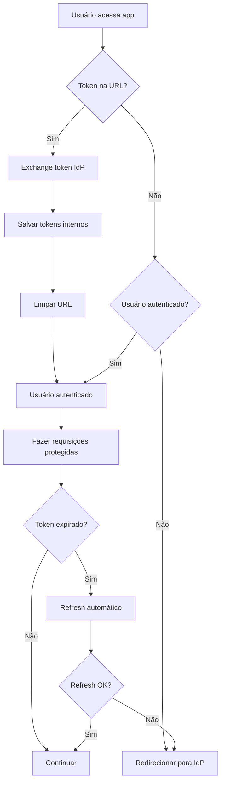

# Guia de Autenticação - Nexus Leads

Este documento explica como usar o sistema de autenticação implementado no frontend da aplicação Nexus Leads.

## Visão Geral

O sistema de autenticação suporta dois cenários principais:

1. **Cenário Principal (IdP redireciona com token)**: O usuário faz login no IdP (Identity Provider) e é redirecionado de volta com um token JWT na URL
2. **Cenário Alternativo (login direto)**: O usuário faz login diretamente na API usando username/password

## Arquitetura

### Serviços

- **`authService.ts`**: Gerencia tokens, faz exchange, refresh e logout
- **`httpClient.ts`**: Intercepta requisições, adiciona tokens e faz refresh automático
- **`use-auth.ts`**: Hook React para gerenciar estado de autenticação

### Fluxo de Autenticação



## Como Usar

### 1. Hook useAuth

```tsx
import { useAuth } from "@/hooks/use-auth";

function MyComponent() {
  const {
    isAuthenticated,
    isLoading,
    userClaims,
    login,
    loginWithIdpToken,
    logout,
    processIdpRedirect,
  } = useAuth();

  // Processar redirect do IdP quando o componente carrega
  useEffect(() => {
    processIdpRedirect();
  }, [processIdpRedirect]);

  if (isLoading) return <div>Carregando...</div>;

  if (!isAuthenticated) {
    return <LoginForm />;
  }

  return <Dashboard />;
}
```

### 2. Login Direto

```tsx
const handleLogin = async () => {
  const success = await login(username, password);
  if (success) {
    // Usuário logado com sucesso
  } else {
    // Falha no login
  }
};
```

### 3. Login com Token IdP

```tsx
const handleIdpTokenLogin = async () => {
  const success = await loginWithIdpToken(idpToken);
  if (success) {
    // Token trocado com sucesso
  } else {
    // Falha ao trocar token
  }
};
```

### 4. Fazer Requisições Protegidas

```tsx
import { httpClient } from "@/services/httpClient";

// O httpClient automaticamente adiciona o token Bearer
// e faz refresh quando necessário
const leads = await httpClient.getLeads();
```

## Endpoints da API

### POST `/token/exchange`

Troca token do IdP por tokens internos.

**Request:**

```json
{
  "token": "<jwt_do_idp>"
}
```

**Response:**

```json
{
  "access_token": "...",
  "refresh_token": "...",
  "token_type": "bearer"
}
```

### POST `/login`

Login direto com username/password.

**Request (Form-URL-Encoded):**

```
username=usuario&password=senha
```

**Response:**

```json
{
  "access_token": "...",
  "refresh_token": "...",
  "token_type": "bearer",
  "user": {
    "id": "123",
    "username": "usuario",
    "email": "usuario@exemplo.com"
  }
}
```

### POST `/refresh`

Renova access token usando refresh token.

**Request:**

```json
{
  "refresh_token": "<refresh_token>"
}
```

**Response:**

```json
{
  "access_token": "...",
  "refresh_token": "...",
  "token_type": "bearer"
}
```

## Configuração

### Variáveis de Ambiente

```env
# URL da API
VITE_API_URL=https://api.nexusvitally.com.br

# URL do IdP para logout
VITE_IDP_LOGIN_URL=https://seu-idp/login
```

### Headers de Requisição

Todas as requisições protegidas incluem automaticamente:

```
Authorization: Bearer <access_token>
```

## Recursos Implementados

### ✅ Token Management

- Salvamento automático em localStorage
- Carregamento automático na inicialização
- Limpeza automática no logout

### ✅ Auto Refresh

- Interceptação de 401 errors
- Refresh automático do access token
- Fila de requisições durante refresh
- Retry automático após refresh

### ✅ IdP Integration

- Processamento automático de redirects
- Limpeza de URL após exchange
- Redirecionamento para IdP no logout

### ✅ Error Handling

- Tratamento de erros de autenticação
- Fallback para IdP quando refresh falha
- Logs detalhados para debugging

## Exemplo Completo

Veja o arquivo `src/components/auth/AuthExample.tsx` para um exemplo completo de como usar o sistema de autenticação.

## Troubleshooting

### Token não está sendo enviado

- Verifique se o usuário está autenticado
- Verifique se os tokens estão salvos no localStorage
- Verifique se a URL da API está correta

### Refresh falha constantemente

- Verifique se o refresh_token é válido
- Verifique se o endpoint `/refresh` está funcionando
- Verifique se a URL do IdP está configurada corretamente

### Redirect do IdP não funciona

- Verifique se o parâmetro `token` está na URL
- Verifique se o endpoint `/token/exchange` está funcionando
- Verifique os logs do console para erros

## Segurança

- Tokens são armazenados em localStorage (considerar httpOnly cookies para produção)
- Access tokens expiram em ~30 minutos
- Refresh tokens têm vida útil maior
- Logout limpa todos os tokens e redireciona para IdP
- Todas as requisições usam HTTPS em produção
